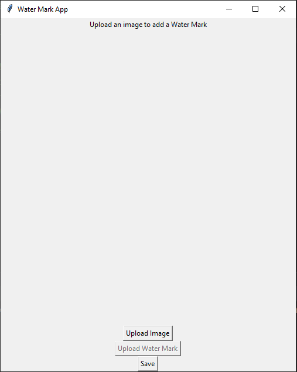

# WaterMark

  

## Description
Welcome to my project! This is a WaterMarkApp made in Python. With this app, users can easily protect their images. It allows users to add an image as a watermark quickly and easily. I hope you like it, and I look forward to your contributions!

## Contributing

We appreciate any contributions! Here are some ways you can contribute:

Report bugs: If you encounter any bugs, please let us know. Open up an issue and let me know the problem. 
Contribute code: If you are a developer and want to contribute, follow the instructions below to get started! 
Suggestions: If you don't want to code but have some awesome ideas, open up an issue explaining some updates or imporvements 
you would like to see! 
Documentation: If you see the need for some additional documentation, feel free to add some!

## Instructions

Fork this repository. 
Create a branch: `git checkout -b <branch_name>`. 
Make your changes and commit them: `git commit -m '<commit_message>'` 
Push to the original branch: `git push origin simple-weather/<location>` 
Create the pull request.

## Maintainer & Contributors
[@wolflergf](https://github.com/wolflergf)

## Contact
If you want to contact me you can send an email to wolflergf@gmail.com

## License
This project uses the following license: [GNU GPLv3](https://www.gnu.org/licenses/gpl-3.0.html).
